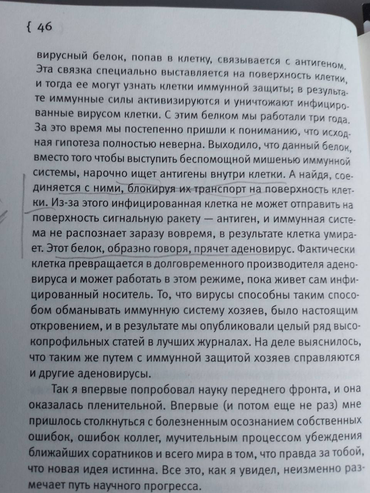
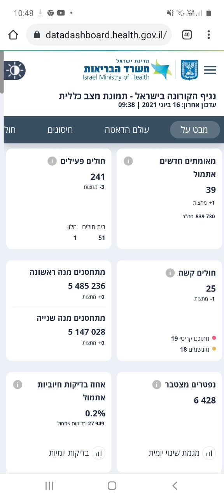
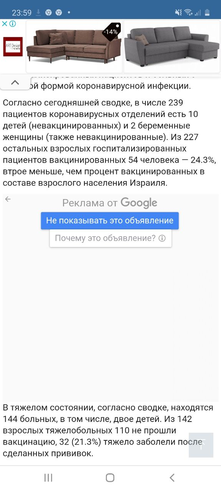
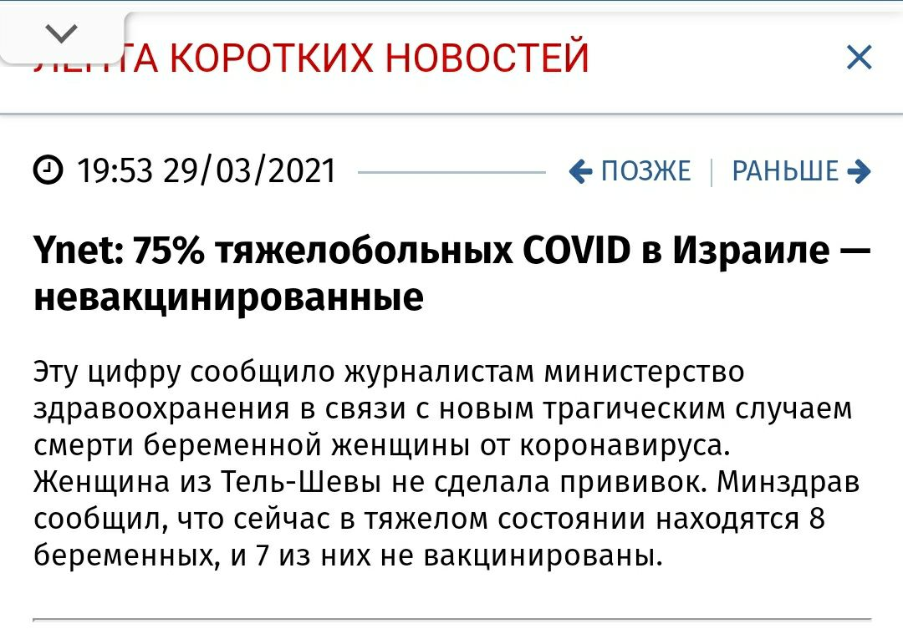
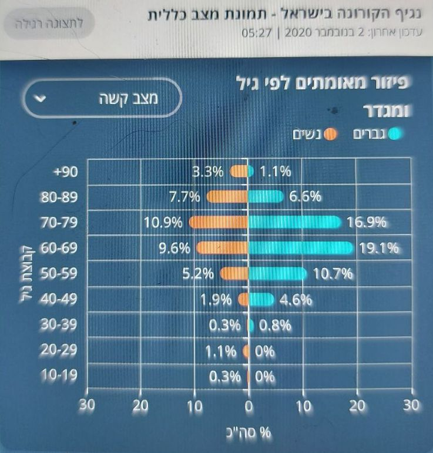

Марина Фазулина

## Про "Спутник"

Это векторная вакцина, основана на аденовирусе.

А что из себя представляет сам аденовирус и почему аденовирусная инфекция (температура, фарингит, коньюктивит) протекает обычно 3 недели. Любое другое орви - 7 дней (на 7 сутки начинают вырабатываться антитела, а при аденовирусе только на 21).

Тут подробно описан механизм действия вируса. Он, оказывается, использует антиген, чтобы проникнуть внутрь клетки и там спрятаться от антител. И потом сам себя начинает усиленно воспроизводить. Его все -таки потом убивает имммунная система, но через 21 день - очень долго.

Теперь вакцина. К аденовирусу прицепили "часть" ковида. Аденовирус проникает в клетку и начинает и себя воспроизводить - и еще ковид. Те, кто недавно переболели аденовирусом, и у кого иммунитет еще помнит этот вирус, его быстро инактивировали. И речи о развитии хоть какого-то иммунитета нет совсем.

У других, аденовирус начинает воспроизводить себя и ту часть ковида, что к нему прилеплена. Причем, 3 недели. И в итоге человек может стать распространителем вируса. Что с его организмом произойдет через 21 день, я не знаю, если честно. По идее, аденовирус должен будет иммунитетом инактивироваться. С ковидом вместе или нет, не знаю.

Есть ои смысл делать ревакцинацию Спутником, или делать 2 вакцину? Никакого. Как только 2 доза булет введена, так иммунитет, а он запомнил, что нелавно имел дело с аденовирусом, так сразу его инактивирует. А вводят именно через 21 день. Это про Спутник.

Про то, что аденовирус является онкогенным вирусом, вообще мало информации. И что потом будет, какие процессы запустит этот искусственно внедренный аденовирус, будет известно через годы-десятилетие.

## Теперь про вакцины мРНК

Pfizer - это мРНК. Тут проблема другая. Эти вакцины вырабатывают антитела на 1-единственный белок, на шип-белок ковида. Но вирус подвержен мутациям. И если произойдет мутация именно в этом белке, то антитела не только не инактивируют вирус, а наоборот, становятся неиннактивируемыеми антителами. И развивается тяжелая реакция [ADE](https://ru.wikipedia.org/wiki/Антителозависимое_усиление_инфекции).

Кошки тоже болеют ковидной инфекцией. У них развивается перитонит. Кошкам сделали мРНК вакцину. Все привитые кошки, при повторном контакте с вирусом погибли. Развился именно этот самый ADE.

И пробовали сделать аналогичную вакцину против лихорадки Денге. Там, страдают дети: Азия, Африка, Южная Америка. Вакцину сделали. Привили часть детей (врать не буду, не помню, в какой части света). Но все привитые, при контакте с диким вирусом умерли. Тему закрыли. Вакцину больше не производят.

 **TODO** найти ссылку на научную статью (ее подавали к печати в мае прошлого года, а одобрили только в августе. Уже после того, как Pfizer зарегистировал свою вакцину)

В Израиле, из 450000 подростков, привито вакциной было 23000. Из них у 58 развился миокардит - поражение миокарда. Инвалиды на всю жизнь. Это именно проявление ADE.

Дети и подростки болеют легко. Случаи тяжелых форм ковида есть, но реже, гораздо реже, чем 58 человек на 23000. Врачи-педиатры поднимали вопрос об отмене вакцинации детей. Тем не менее, минздрав принял решение о вакцинации. Правда, о добровольной, в отличие от взрослых.

Сколько среди больных тяжелой формой ковида привитых, статистика местная не указывает. Как-то проскочило в СМИ, что из тяжелых на тот момент 109 человек 51 не привитой - какой ужас! Но, извините, выходит, что 58 - это привитые? И их даже больше, чем не привитых.

Я вела и фиксировала статистику, начиная с октября прошлого года. И есть удивительная связь: когда в декабре начали прививать 75 и старше, именно в этой группе повысилась смертность. Когда в феврале сиали прививать от 50 до 70, то именно в этой возрастной категории подскочила смертность... Стали прививать 20-29, и тогда пошли миокардиты...

## Насчет масок

3 дня назад отменили в Израиле маски. Смотрим на статистику. Просто цифры, ничего личного:

Данные за сегодня (17 июня 2021 года). Больных 241 (левый верхний угол).

Вчера их было 221. До этого 205.

(Официальные данные с сайта минздрава)

Нижний левый угол - это процент выявленных больных среди сделавших мазок. Он тоже вырос

Как пример, что если соблюдать эпидпредписанния, то заболеваимость будет сведена к минимуму. Люди [просто соблюдали все эпидпредписания всей деревней без исключения](https://www.9tv.co.il/item/30352)

[Насчет иммунитета у переболевших](https://www.vesty.co.il/main/article/SJFOEvpFO)

О том, что дети [болеют практически без "клиники"](https://www.vesty.co.il/main/article/SyiQ1KD900)

Насчет миокардитов..тут более точная информация, [сколько заболело миокардитом за год подростков, и сколько среди них привитых](https://newsru.co.il/health/01jun2021/pfizer_0010.html)

Острый [миокардит после 2 вакцины](https://news.israelinfo.co.il/health/92584)

**TODO** Статью про ковид у кошек и лихорадку надо искать

## Подборка разных новостей насчет ковида

[Минздрав Израиля начал публиковать сведения о числе тяжелых случаев COVID после вакцинации](https://news.israelinfo.co.il/health/94440)

Это сведения были на апрель 21 года

Там такая статистика есть про заболевших вакцинированных

Минздрав Израиля [известил FDA о тяжелых побочных эффектах вакцины Pfizer](https://news.israelinfo.co.il/health/94382) (Еще от апреля 21 года)

Cтатья о том, что [педиатры были против вакцинации детей](https://news.israelinfo.co.il/health/94098)

Почему в вакцинированном Израиле [процент тяжелых случаев COVID в 20 раз выше, чем в остальном мире?](https://news.israelinfo.co.il/health/94072)

Это, вот очень интересное наблюдение. То есть больных в Израиле мало, но процент тяжелых среди них высок. Почему?! Официальный минздрав ответа не дает. Точнее, он списывает на непривитых, не подкрепляя никакими цифрами.

___

Вот, еще была заметка. Тут интересно, что 25% тяжелых - это привитые. И это очень много.

___

https://www.vesty.co.il/main/article/SyCBdoPXu а тут обратите внимание на пункт 7. Минздрав запретил делать анализ на антитела. Чтобы не было поводов отказаться от прививки.

11.03.2021 года. То есть с этой даты у израильтян не было возможности избежать вакцинацию, так как увольняли с работы и так далее, если не прививались.

___

23 февраля было разрешено делать анализ на определение антител, чтобы избежать вакцинации, если переболели, а 11 марта, уже запретили, потому что народ повалил делать анализы,а не вакцинироваться.

_____

Статистика. Ноябрь 2020. По возрасту и по полу % тяжелых. 2 ноября.

___

18 января 21 года. Вакцинация идет уже почти месяц / с 22 декабря/ то же данные по тяжелым. Голубые справа - мужчины. Оранжевые или зеленые - женщины.

____

Это за февраль. От 13 февраля. Разрешили вакцинацию 30 и старше.

Сейчас с датами нет на сайте таких графиков. Сейчас они выдают только средние показатели.

Это тяжелые за год

Это за 6 месяцев

Это за 3

Это за последний месяц

Сейчас разрешено прививать детей с 12 до 15 лет.

Вот, еще есть данные за 5 марта.

Вакцинация 50-летних и старше полным ходом

Это вот график вакцинированных от того же числа 5 марта. Темно-зеленые - 1 доза. Салатовые - получившие 2 дозы.

А это график вакцинации от 18 февраля.

**TODO** математически рассчитать зависимость от количества привитых и процента тяжелых (меняется он или нет)
