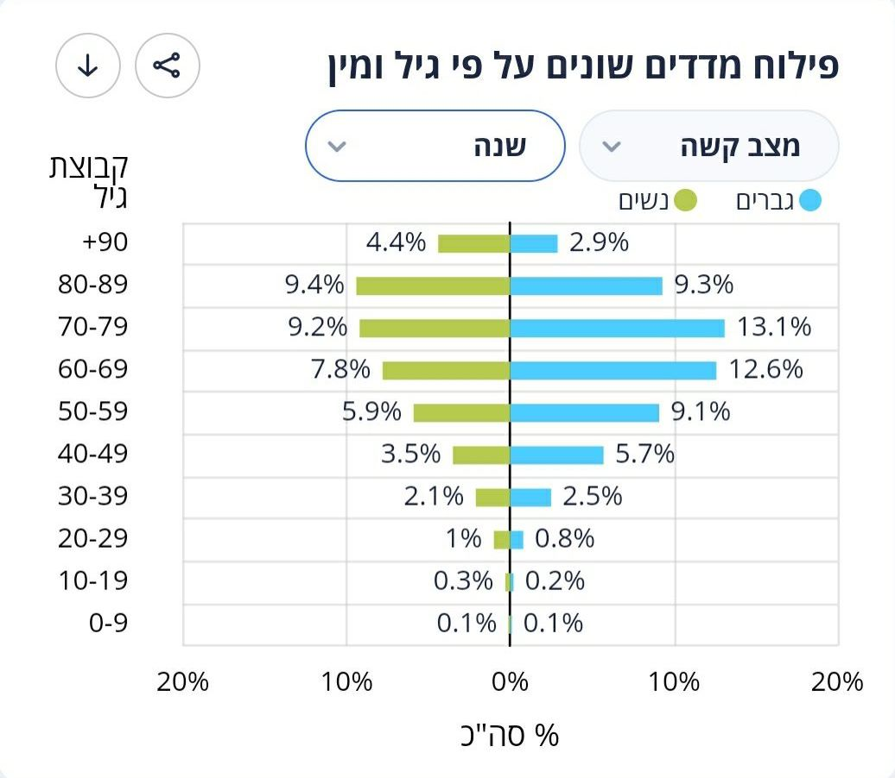
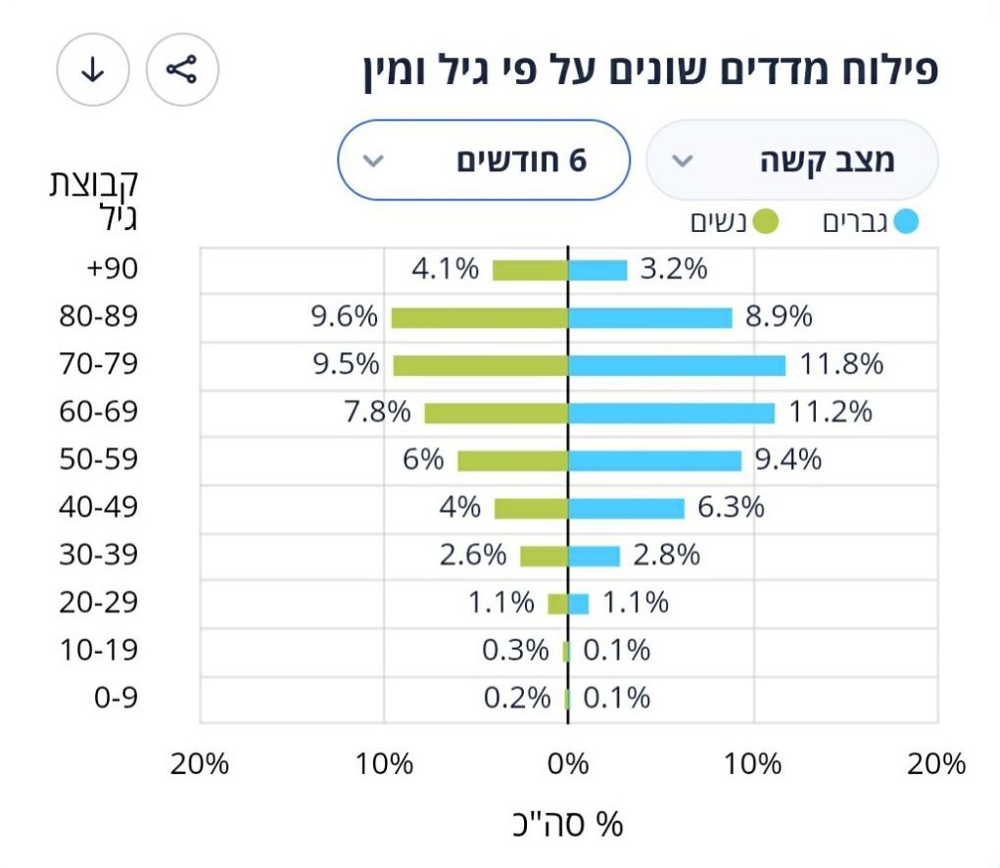
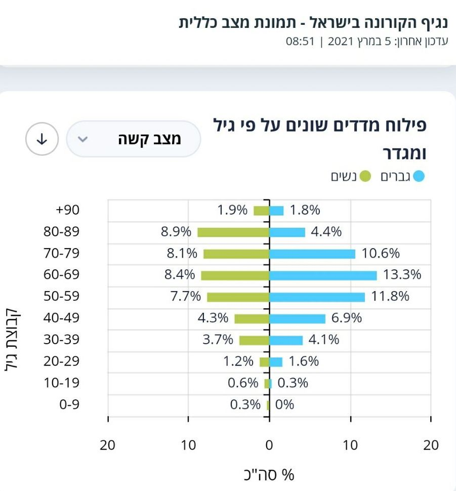

# Вакцины и ковид в Израиле

*Автор: Марина Фазулина — врач, культуролог. Училась в РГМУ им. Пирогова, затем на факультете истории искусства РГГУ. Живет в Израиле*

17 июня 2021 года

## "Спутник"

Это векторная вакцина, основана на аденовирусе.

Аденовирусная инфекция (температура, фарингит, конъюнктивит) протекает обычно 3 недели. Любое другое ОРВИ - 7 дней; на 7-е сутки начинают вырабатываться антитела, а при аденовирусе только на 21-е.

> "... данный белок, вместо того, чтобы выступить беспомощной мишенью иммунной системы, нарочно ищет антигены внутри клетки. А найдя, соединяется с ними, блокируя их транспорт на поверхность клетки. Из-за этого инфицированная клетка не может отправить на поверхность сигнальную ракету - антиген, и имунная система не распознает заразу вовремя, в результате клетка умирает. Этот белок, образно говоря, прячет аденовирус. Фактически клетка превращается в долговременного производителя аденовируса и может работать в этом режиме, пока живет сам инфицированный носитель."
>
> [Источник](1.jpeg): Сванте Пэабо. "Неандерталец. В поисках исчезнувших геномов"

Тут описан механизм действия аденовируса. Он, оказывается, использует антиген, чтобы проникнуть внутрь клетки и там спрятаться от антител. И потом сам себя начинает усиленно воспроизводить. Его все-таки потом убивает иммунная система, но через 21 день - очень долго.

Теперь вакцина. К аденовирусу прицепили "часть" ковида. Аденовирус проникает в клетку и начинает и себя воспроизводить - и еще ковид. Те, кто недавно переболели аденовирусом, и у кого иммунитет еще помнит этот вирус, его быстро инактивировали. И речи о развитии хоть какого-то иммунитета нет совсем.

У других, аденовирус начинает воспроизводить себя и ту часть ковида, что к нему прилеплена. Причем, 3 недели. И в итоге человек может стать распространителем вируса. Что с его организмом произойдет через 21 день, я не знаю, если честно. По идее, аденовирус должен будет иммунитетом инактивироваться. С ковидом вместе или нет, не знаю.

Есть ли смысл делать ревакцинацию Спутником, или делать вторую вакцину? Никакого. Как только вторая доза будет введена, иммунитет (а он запомнил, что недавно имел дело с аденовирусом) сразу его инактивирует. А вводят именно через 21 день.

Про то, что аденовирус является онкогенным вирусом, вообще мало информации. И что потом будет, какие процессы запустит этот искусственно внедренный аденовирус, будет известно через годы-десятилетие.

## Вакцины мРНК

[Pfizer](https://ru.wikipedia.org/wiki/Вакцина_Pfizer/BioNTech_против_COVID-19) - это мРНК. Тут проблема другая. Эти вакцины вырабатывают антитела на один-единственный белок, на шип-белок ковида. Но вирус подвержен мутациям. И если произойдет мутация именно в этом белке, то антитела не только не инактивируют вирус, а наоборот, становятся неинактивируемыеми антителами. И развивается тяжелая реакция [ADE](https://ru.wikipedia.org/wiki/Антителозависимое_усиление_инфекции).

Кошки тоже болеют ковидной инфекцией - у них развивается перитонит. Кошкам сделали мРНК вакцину. Все привитые кошки, при повторном контакте с вирусом погибли. Развился именно этот самый ADE.

И пробовали сделать аналогичную вакцину против лихорадки Денге. Там, страдают дети: Азия, Африка, Южная Америка. Вакцину сделали. Привили часть детей (врать не буду, не помню, в какой части света). Но все привитые, при контакте с диким вирусом умерли. Тему закрыли. Вакцину больше не производят.

 **TODO** найти ссылку на научную статью (ее подавали к печати в мае прошлого года, а одобрили только в августе. Уже после того, как Pfizer зарегистрировал свою вакцину)

В Израиле, из 450000 подростков, привито вакциной было 23000. Из них у 58 развился миокардит - поражение миокарда: инвалиды на всю жизнь. Это именно проявление ADE.

Дети и подростки болеют легко. Случаи тяжелых форм ковида есть, но реже, гораздо реже, чем 58 человек на 23000. Врачи-педиатры поднимали вопрос об отмене вакцинации детей. Тем не менее, минздрав принял решение о вакцинации. Правда, о добровольной, в отличие от взрослых.

Сколько среди больных тяжелой формой ковида привитых, статистика местная не указывает. Как-то проскочило в СМИ, что из тяжелых на тот момент 109 человек 51 не привитой - какой ужас! Но, извините, выходит, что 58 - это привитые? И их даже больше, чем не привитых.

Я вела и фиксировала статистику, начиная с октября прошлого года. И есть удивительная связь: когда в декабре начали прививать 75 и старше, именно в этой группе повысилась смертность. Когда в феврале стали прививать от 50 до 70, то именно в этой возрастной категории подскочила смертность... Стали прививать 20-29, и тогда пошли миокардиты...

## Маски

3 дня назад в Израиле отменили маски. Смотрим на статистику. Просто цифры, ничего личного.

Данные за сегодня (17 июня 2021 года). Больных [241](2.jpeg "левый верхний угол").

Вчера их было [221](3.jpeg). До этого [205](4.jpeg). (Официальные данные с [сайта минздрава](https://health.gov.il))

Процент выявленных больных среди сделавших мазок тоже вырос (нижний левый угол на скриншотах).

Как пример, что если соблюдать эпид. предписания, то заболеваемость будет сведена к минимуму: например, люди [просто соблюдали все эпид. предписания всей деревней без исключения](https://www.9tv.co.il/item/30352).

## Новости

- Иммунитет у привитых переболевших короновирусом [может сохраняться годами](https://www.vesty.co.il/main/article/SJFOEvpFO)

- Дети [болеют практически без "клиники"](https://www.vesty.co.il/main/article/SyiQ1KD900)

- Насчет миокардитов тут более точная информация: [сколько заболело миокардитом за год подростков, и сколько среди них привитых](https://newsru.co.il/health/01jun2021/pfizer_0010.html)

- Острый [миокардит после 2 вакцины](https://news.israelinfo.co.il/health/92584)

- Минздрав Израиля [начал публиковать сведения о числе тяжелых случаев COVID после вакцинации](https://news.israelinfo.co.il/health/94440). Это сведения были на апрель 21 года, там есть [статистика](5.jpeg) про заболевших вакцинированных

- Минздрав Израиля известил FDA о [тяжелых побочных эффектах вакцины Pfizer](https://news.israelinfo.co.il/health/94382) (еще от апреля 21 года)

- Статья о том, что [педиатры были против вакцинации детей](https://news.israelinfo.co.il/health/94098)

- Почему в вакцинированном Израиле [процент тяжелых случаев COVID в 20 раз выше, чем в остальном мире?](https://news.israelinfo.co.il/health/94072) Это очень интересное наблюдение. То есть больных в Израиле мало, но процент тяжелых среди них высок. Почему?! Официальный минздрав ответа не дает. Точнее, он списывает на непривитых, не подкрепляя никакими цифрами

- 25% "тяжелых" - [это привитые](6.jpeg). И это очень много!

- Минздрав запретил делать анализ на антитела. Чтобы не было поводов отказаться от прививки. [Обратите внимание на пункт 7](https://www.vesty.co.il/main/article/SyCBdoPXu). 11.03.2021 года. То есть, с этой даты у израильтян не было возможности избежать вакцинацию, так как увольняли с работы и так далее, если не прививались

- Среди израильтян, получивших вторую дозу вакцины, [короновирус выявлен у 0.07%](7.jpeg)

- 23 февраля [было разрешено](8.jpeg) делать анализ на определение антител, чтобы избежать вакцинации, если переболели, а 11 марта, уже запретили, потому что народ повалил делать анализы, а не вакцинироваться.

## Статистика

### "Тяжелые"

2 ноября 2020. Процент "тяжелых" по возрасту и по полу.

18 января 21 года. Вакцинация идет уже почти месяц (с 22 декабря). Тоже данные по "тяжелым". Голубые справа - мужчины. Оранжевые или зеленые - женщины.

График от 13 февраля 2021 года. Разрешили вакцинацию 30 и старше.

Сейчас с датами [на сайте](health.gov.il) нет таких графиков - они выдают только средние показатели.

"Тяжелые" за год

За 6 месяцев

За 3 месяца

За последний месяц

Данные за 5 марта 2021 года.

### Вакцинация

Сейчас разрешено прививать детей с 12 до 15 лет. Вакцинация 50-летних и старше идет полным ходом

Это вот график вакцинированных от того же 5 марта. Темно-зеленые - 1 доза. Салатовые - получившие 2 дозы.

А это график вакцинации от 18 февраля.

**TODO** рассчитать корреляцию количества привитых и процента тяжелых
